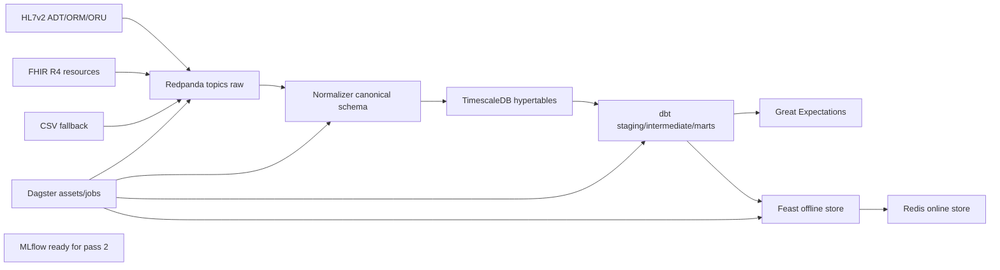

# CarePredict MVP v0 - Passe 1

CarePredict prepare une couche souveraine d'ingestion et de feature engineering pour predire, en passe 2, la charge en soins nursing SIIPS/AAS a J+12h.

## Quickstart

```bash
cp .env.example .env
make up
make seed
make features
make test
```

Services locaux :

- Dagster UI : <http://localhost:3000>
- MLflow : <http://localhost:5000>
- Redpanda Kafka API : `localhost:19092`
- TimescaleDB : `localhost:5432`
- Redis online store : `localhost:6379`

## Architecture



## Feature Set Cible

La passe 1 expose au moins 50 features versionnees dans Feast.

Temporelles :
`admissions_1h`, `admissions_6h`, `admissions_24h`, `discharges_1h`, `discharges_6h`, `discharges_24h`, `avg_los_24h`, `avg_los_7d`, `occupancy_rate`, `occupancy_delta_6h`, `siips_mean_6h`, `siips_mean_24h`, `siips_mean_7d`, `siips_std_24h`, `care_load_trend_6h`.

Effectifs :
`nurse_count_shift`, `aide_count_shift`, `total_staff_shift`, `patients_per_nurse`, `patients_per_aide`, `overtime_hours_shift`, `avg_seniority_months`, `night_shift_flag`, `weekend_staff_ratio`, `staffing_gap`.

Calendaires :
`hour_of_day`, `day_of_week`, `is_weekend`, `is_public_holiday_fr`, `season`, `is_school_holiday_fr`, `shift_bucket`, `month_of_year`.

Structurelles :
`hospital_id_encoded`, `service_id_encoded`, `specialty_encoded`, `bed_count`, `patient_profile_encoded`, `surgical_service_flag`, `medical_service_flag`, `critical_care_flag`, `geriatric_profile_flag`, `historical_case_mix_index`.

Interventions futures connues :
`scheduled_discharges_12h`, `scheduled_surgeries_12h`, `expected_transfers_in_12h`, `expected_transfers_out_12h`, `scheduled_admissions_12h`, `planned_procedures_12h`, `known_isolation_rooms_12h`.

## Ajouter un connecteur SIH

1. Ajouter un parser dans `services/connectors/`.
2. Mapper les evenements vers les schemas Pydantic de `services/connectors/schemas/canonical.py`.
3. Publier les messages bruts dans un topic Redpanda dedie ou existant.
4. Brancher la normalisation dans `services/connectors/normalizer.py`.
5. Ajouter tests unitaires et integration Redpanda -> TimescaleDB.

## Souverainete

Aucun service cloud managé n'est requis. La stack locale utilise Redpanda, TimescaleDB, Redis, Feast, dbt, Dagster et MLflow en conteneurs avec tags explicites.

## Passe 2 - Encoder Hybride

Le premier composant ML est `HybridStateEncoder`, disponible dans `services/ml/encoders/hybrid_encoder.py`. Il encode 24 pas horaires de features temporelles et les features statiques service/hopital en un vecteur d'etat 512D reutilisable par les modeles de forecasting.
